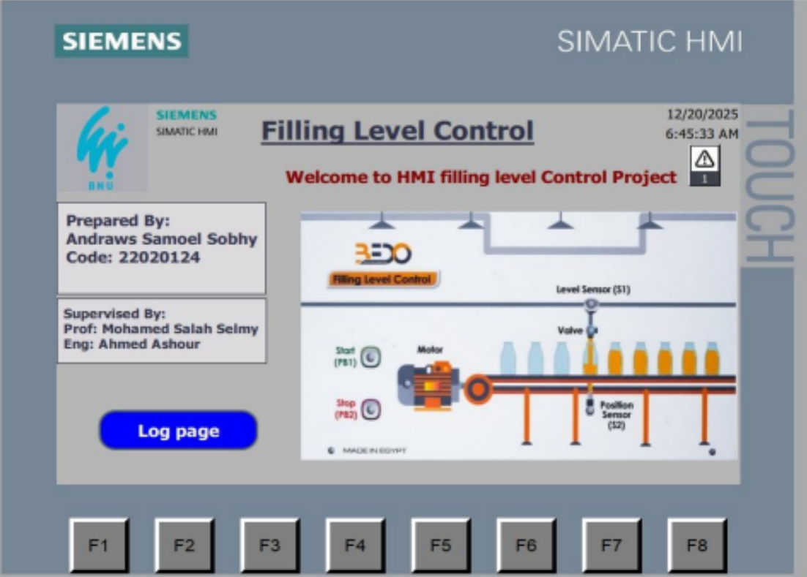

# Technical Project Report
## Filling Level Control System Using PLC S7-1200 with HMI Integration

---

## 1. Introduction

Industrial automation using PLC systems is a cornerstone of modern manufacturing. This project implements an automated liquid filling system using the **Siemens PLC S7-1200**. The system relies on sensors to detect bottle position and liquid level, enhancing accuracy and productivity in bottling operations.

An integrated **HMI panel** extends the system with a user-friendly interface for control, monitoring, alarm management, and trend analysis.

---

## 2. Project Description

The system is designed to fill bottles automatically up to a specified level. When started, the conveyor belt moves bottles until a position sensor detects one, prompting the motor to stop. A valve then opens to fill the bottle. Once the level sensor detects that the desired fill level is reached, the valve closes and the conveyor resumes operation.

---

## 3. Objectives

- Automate the filling process using sensors and a Siemens S7-1200 PLC
- Increase production efficiency and minimize liquid waste
- Ensure accurate and consistent liquid level in each bottle
- Provide operator usability through an HMI interface
- Demonstrate practical application of PLC + HMI in industrial automation

---

## 4. Components Used

| Component | Description |
|---|---|
| Siemens S7-1200 PLC | Main programmable logic controller (CPU 1214C DC/DC/DC) |
| HMI Panel | Siemens KTP700 Basic PN (or equivalent WinCC-compatible panel) |
| Conveyor Motor | Drives the bottle transport belt |
| Position Sensor (S2) | Detects bottle presence at filling station |
| Level Sensor (S1) | Detects when bottle reaches target fill level |
| Solenoid Valve | Controls liquid flow into bottle |
| Start Push Button (PB1) | Momentary NO button to start operation |
| Stop Push Button (PB2) | Momentary NC button to stop operation |

---

## 5. Working Methodology

1. The operator presses the **START** button (I0.0)
2. The conveyor motor (Q0.0) starts and bottles move along the belt
3. When a bottle reaches the filling point, the **position sensor** (I1.4) is triggered
4. The motor stops and the **solenoid valve** (Q0.1) opens to begin filling
5. The valve remains open (self-latched) until the **level sensor** (I1.3) detects the bottle is full
6. The valve closes, and the motor restarts to advance the next bottle
7. The cycle repeats automatically; pressing **STOP** (I0.1) halts the process at any point

---

## 6. System Inputs and Outputs

### Digital Inputs

| Tag Name | Address | Contact Type | Description |
|---|---|---|---|
| `start` | I0.0 | NO | Start push button |
| `stop` | I0.1 | NC | Stop push button |
| `level_sensor` | I1.3 | NO (physical) | Detects fill level reached |
| `position_sensor` | I1.4 | NO (physical) | Detects bottle at station |

### Digital Outputs

| Tag Name | Address | Description |
|---|---|---|
| `motor` | Q0.0 | Conveyor belt motor drive |
| `valve` | Q0.1 | Solenoid fill valve |
| `1start` | Q0.2 | Start indicator light |
| `1stop` | Q0.3 | Stop indicator light |
| `1level_sensor` | Q0.4 | Level sensor indicator |
| `1position_sensor` | Q0.5 | Position sensor indicator |

---

## 7. Ladder Logic Network Explanations

### Network 1 — Motor Control

The first press of START energizes the motor. A self-latch (using Q0.0 parallel to I0.0) sustains motor operation without requiring the button to be held.

- The **position sensor** contact is placed as **NC** in the rung: when the sensor fires (I1.4 = 1), the NC contact opens and the motor stops.
- The **stop button** (NC) de-energizes the rung when pressed.
- The **valve** (NC) interlock prevents motor and valve from operating simultaneously.
  

### Network 2 — Valve Control

When the position sensor detects a bottle (I1.4 = 1), the valve opens. A self-latch sustains valve operation independently of the position sensor.

- The **level sensor** contact is **NC**: when the bottle is full (I1.3 = 1), the NC contact opens and closes the valve.
- The **motor** (NC) interlock prevents filling while the conveyor moves.

### Network 3 — Motor Resume

When the level sensor signals a full bottle (I1.3 = 1), this network re-enables the motor to advance to the next bottle. A self-latch sustains the motor until the next position sensor trigger.

### Network 4 — Indicator Outputs

Pass-through rungs that map each input directly to an output indicator light. These serve as both physical panel indicators and HMI status feeds. No logic interlocking — purely diagnostic.

---

## 8. HMI Integration

### Overview

The HMI is designed in **TIA Portal WinCC** and communicates with the S7-1200 over PROFINET. It provides layered access control, real-time process visualization, alarm handling, and trend logging.

### Screen Structure

| Screen | Purpose | Minimum Access Level |
|---|---|---|
| Home | Welcome / entry point | Public |
| Login | Authentication | Public |
| Monitoring | Real-time process view | Operator |
| Alarms | Active alarm list | Operator |
| Control | Start/Stop commands | Engineer |
| Trends | Historical variable graphs | Engineer |
| Settings | System configuration | Administrator |

### User Access Levels

| Role | Access |
|---|---|
| Operator | Monitoring + Alarms |
| Engineer | Monitoring + Alarms + Control + Trends |
| Administrator | Full access including Settings |

### Key HMI Tags

| Tag | Type | Address | Function |
|---|---|---|---|
| Start | Bool | M0.0 | HMI Start command |
| Stop_Emergency | Bool | M0.1 | HMI Stop/E-Stop |
| Position_Sensor | Bool | M0.3 | Position sensor status |
| Level_Sensor | Bool | M0.4 | Level sensor status |
| Motor | Bool | Q0.0 | Motor status feedback |
| Valve | Bool | Q0.1 | Valve status feedback |
| motor_alarm | INT | MW23 | Motor alarm (analog) |
| Level_alarm | INT | MW26 | Level alarm |
| position_alarm | INT | MW28 | Position alarm |
| Valve_alarm | INT | MW30 | Valve alarm |

---

## 9. Sensors Used

### Position Sensor (S2)

A position sensor detects and measures linear or angular displacement of an object relative to a reference point. In this system it detects when a bottle arrives at the filling station.

**Common Types:**
- Potentiometers (variable resistance)
- Encoders (optical/magnetic, high precision)
- LVDT (Linear Variable Differential Transformer)
- Hall Effect Sensors (magnetic field detection)
- Ultrasonic / LIDAR (distance measurement)

**Applications:** Robotics, automotive throttle control, CNC machines, consumer electronics.

### Level Sensor (S1)

A level sensor detects, measures, and monitors the height or volume of liquid in a container. In this system it signals when the bottle has reached its target fill level.

**Common Types:**
- Float Sensors (mechanical buoyancy)
- Ultrasonic Sensors (sound wave distance)
- Capacitive Sensors (capacitance change)
- Radar / Microwave (non-contact electromagnetic)
- Hydrostatic Pressure Sensors (pressure-based measurement)
- Optical Sensors (infrared/laser reflection)

**Applications:** Industrial tanks, consumer appliances, agricultural irrigation, automotive fuel monitoring.

---

## 10. Results and Observations

- The system successfully achieved automated and repeatable bottle filling
- Accurate sensor response was observed with no false triggers
- The motor-valve interlock prevented simultaneous operation reliably
- The self-latching mechanism ensured stable, sustained operation
- The HMI provided clear, real-time feedback and responsive control
- Alarm monitoring via HMI enabled early fault detection

---

## 11. Possible Future Improvements

- Add an **analog flow meter** for volumetric liquid measurement (vs. binary level detection)
- Implement a **bottle counter** with production statistics on HMI trend screen
- Introduce **RFID or barcode scanning** for product type detection and recipe-based fill levels
- Add **remote access** via SIMATIC WinCC Web Navigator or mobile app
- Integrate **SCADA** for plant-wide monitoring and data logging
- Add a **manual override mode** for maintenance scenarios

---

## 12. Conclusion

This project demonstrates an effective use of PLC automation combined with HMI integration for a liquid bottling process. The system achieves precise, repeatable control, reduces manual labor, and improves production reliability.

The addition of the HMI significantly enhances the system by providing:
- Role-based security and access control
- Real-time visual feedback for operators
- Structured alarm management for rapid fault response
- Historical trend data for performance evaluation

This combination of PLC + HMI is directly applicable to industrial bottling, pharmaceutical filling, chemical dosing, and similar process automation environments.

---

## 13. References

1. Siemens AG — *SIMATIC S7-1200 Programmable Controller System Manual* (Latest Edition)
2. Siemens AG — *TIA Portal WinCC HMI Engineering Manual*
3. Petruzella, F.D. — *Programmable Logic Controllers*, McGraw-Hill Education
4. Bolton, W. — *Programmable Logic Controllers and Industrial Automation*, Elsevier
5. [Siemens Industry Support Portal](https://support.industry.siemens.com) — Technical FAQs and application examples for S7-1200 and HMI systems
