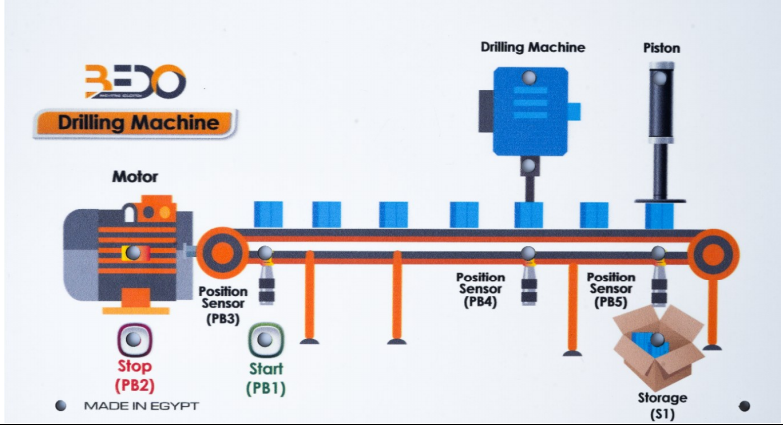
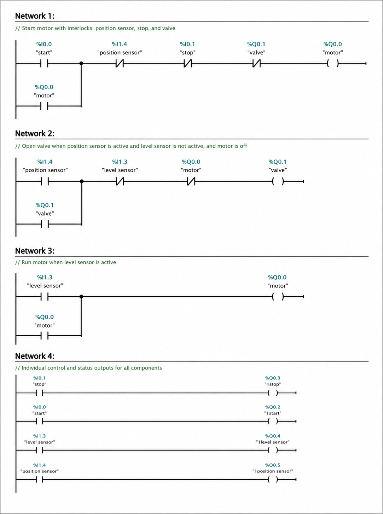
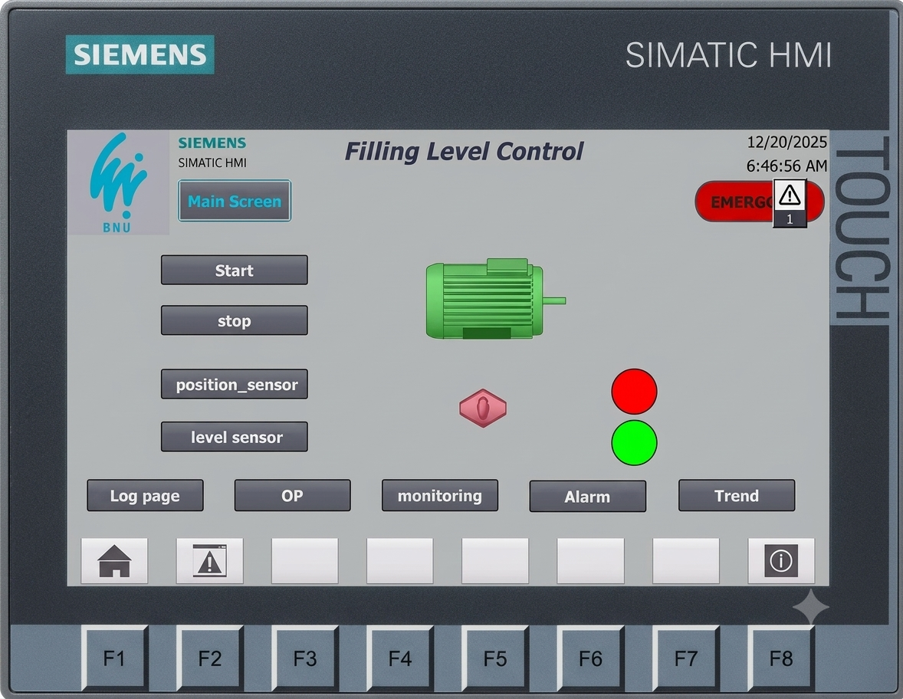

# 🏭 Filling Level Control System — Siemens S7-1200 PLC + HMI

> Automated liquid bottle-filling system with PLC ladder logic and a multi-screen HMI interface built in TIA Portal.

---

## 📋 Table of Contents

- [Project Overview](#project-overview)
- [System Architecture](#system-architecture)
- [Hardware Components](#hardware-components)
- [I/O Address Mapping](#io-address-mapping)
- [Ladder Logic Networks](#ladder-logic-networks)
- [HMI Design](#hmi-design)
- [Repository Structure](#repository-structure)
- [Getting Started](#getting-started)
- [References](#references)

---

## Project Overview

This project implements a fully automated liquid filling system using a **Siemens S7-1200 PLC** programmed in **Ladder Diagram (LAD)** within the **TIA Portal** environment.

The system automatically:
1. Moves bottles along a conveyor belt
2. Stops the conveyor when a bottle is detected by a position sensor
3. Opens a valve to fill the bottle
4. Closes the valve and resumes the conveyor once the level sensor is triggered

An **HMI panel** provides operator control, real-time monitoring, access-level management, alarm handling, and trend visualization.

---

## System Architecture

```
┌─────────────────────────────────────────────────────────┐
│                    OPERATOR (HMI Panel)                  │
│         Home → Login → Control / Monitor / Alarms        │
└────────────────────────┬────────────────────────────────┘
                         │ PROFINET / MPI
┌────────────────────────▼────────────────────────────────┐
│              Siemens S7-1200 PLC (CPU 1214C)             │
│   Inputs: Start, Stop, Position Sensor, Level Sensor     │
│   Outputs: Motor (Conveyor), Valve, Indicator Lights      │
└──────┬───────────────────────────────────────┬──────────┘
       │                                       │
┌──────▼──────┐                       ┌────────▼────────┐
│   CONVEYOR   │                       │  FILLING VALVE  │
│   MOTOR      │                       │   (Solenoid)    │
└─────────────┘                       └─────────────────┘
```

### Sequence of Operation

```
[START pressed]
      │
      ▼
[Motor ON → Conveyor runs]
      │
      ▼
[Position Sensor I1.4 triggered → Bottle detected]
      │
      ▼
[Motor OFF + Valve OPEN → Filling begins]
      │
      ▼
[Level Sensor I1.3 triggered → Bottle full]
      │
      ▼
[Valve CLOSE + Motor ON → Next bottle]
      │
      └──────────────── (repeat) ──────────────────▶
```

---

## Hardware Components

| Component | Model / Type | Role |
|---|---|---|
| PLC | Siemens S7-1200 (CPU 1214C DC/DC/DC) | Main controller |
| HMI Panel | Siemens KTP700 Basic (or similar) | Operator interface |
| Motor | AC/DC Motor | Drives conveyor belt |
| Position Sensor (S2) | Inductive / Optical | Detects bottle at filling point |
| Level Sensor (S1) | Float / Capacitive | Detects when bottle is full |
| Valve | Solenoid Valve | Controls liquid flow |
| Start Button (PB1) | Momentary NO Push Button | Starts system |
| Stop Button (PB2) | Momentary NC Push Button | Stops system |

---

## I/O Address Mapping

### Digital Inputs

| Tag Name | Address | Description |
|---|---|---|
| `start` | I0.0 | Start push button |
| `stop` | I0.1 | Stop push button |
| `level_sensor` | I1.3 | Detects bottle fill level |
| `position_sensor` | I1.4 | Detects bottle at filling station |

### Digital Outputs

| Tag Name | Address | Description |
|---|---|---|
| `motor` | Q0.0 | Conveyor belt motor |
| `valve` | Q0.1 | Liquid fill valve |
| `1start` | Q0.2 | HMI indicator – Start signal |
| `1stop` | Q0.3 | HMI indicator – Stop signal |
| `1level_sensor` | Q0.4 | HMI indicator – Level sensor |
| `1position_sensor` | Q0.5 | HMI indicator – Position sensor |

### HMI Memory Tags

| Tag Name | Data Type | Address | Function |
|---|---|---|---|
| `Start` | Bool | M0.0 | HMI Start command |
| `Stop_Emergency` | Bool | M0.1 | HMI Stop / E-Stop command |
| `Position_Sensor` | Bool | M0.3 | HMI position sensor status |
| `Level_Sensor` | Bool | M0.4 | HMI level sensor status |
| `motor_alarm` | INT | MW23 | Motor alarm trigger |
| `Level_alarm` | INT | MW26 | Level sensor alarm trigger |
| `position_alarm` | INT | MW28 | Position sensor alarm trigger |
| `Valve_alarm` | INT | MW30 | Valve alarm trigger |

---

## Ladder Logic Networks

> See [`ladder-logic/networks.md`](ladder-logic/networks.md) for full network descriptions.



### Network Summary

| Network | Function |
|---|---|
| **Network 1** | Motor start/stop with self-latch, position sensor interlock, valve interlock |
| **Network 2** | Valve control with self-latch, motor interlock, level sensor interlock |
| **Network 3** | Motor re-enable when level sensor triggers (bottle full → conveyor resumes) |
| **Network 4** | Indicator outputs: maps inputs → HMI indicator lights (Q0.2–Q0.5) |

---

## HMI Design

> See [`hmi/hmi-design.md`](hmi/hmi-design.md) for full HMI documentation.

### Screen Map

```
[Home / Welcome Screen]
         │
         ▼
  [Login Screen]
    ├── Operator     ──▶ Monitoring, Alarms
    ├── Engineer     ──▶ Monitoring, Alarms, Trends, Control
    └── Administrator──▶ Full Access (all screens + settings)
         │
         ├──▶ [Operation Control Screen]
         │         Start / Stop / Sensor Commands
         │
         ├──▶ [Monitoring Screen]
         │         Live sensor status, fill progress, bottle detection
         │
         ├──▶ [Alarms Screen]
         │         Active alarms: Valve, Position Sensor, Level Sensor, Motor
         │
         └──▶ [Trend Screen]
                   Historical graphs: fill cycles, sensor events, timing
```

### Access Level Matrix

| Screen | Operator | Engineer | Administrator |
|---|:---:|:---:|:---:|
| Home | ✅ | ✅ | ✅ |
| Monitoring | ✅ | ✅ | ✅ |
| Alarms | ✅ | ✅ | ✅ |
| Trends | ❌ | ✅ | ✅ |
| Control | ❌ | ✅ | ✅ |
| Settings | ❌ | ❌ | ✅ |


---

## Repository Structure

```
plc-hmi-project/
│
├── README.md                    ← You are here
│
├── ladder-logic/
│   └── networks.md              ← Detailed network-by-network explanation
│
├── hmi/
│   └── hmi-design.md            ← Full HMI screen and tag documentation
│
├── docs/
│   └── project-report.md        ← Full technical project report
│
└── assets/
    └── ladder_logic_networks.png ← Ladder diagram screenshot
```

---

## Getting Started

### Prerequisites

- **TIA Portal V16+** (Siemens)
- Siemens S7-1200 PLC (CPU 1214C or compatible)
- WinCC Basic / Comfort (for HMI simulation)

### Simulating in TIA Portal

1. Clone this repository
2. Open TIA Portal and create a new project
3. Add an S7-1200 CPU and a KTP700 Basic HMI panel
4. Reference `ladder-logic/networks.md` to recreate the LAD networks
5. Reference `hmi/hmi-design.md` to configure screens, tags, and alarms
6. Use **PLCSIM** to run the PLC logic and **HMI Runtime Simulator** to test the interface

---

## References

- Siemens AG — *SIMATIC S7-1200 Programmable Controller System Manual*
- Siemens AG — *TIA Portal WinCC HMI Engineering Manual*
- Petruzella, F.D. — *Programmable Logic Controllers*, McGraw-Hill Education
- Bolton, W. — *Programmable Logic Controllers and Industrial Automation*, Elsevier
- [Siemens Support Portal](https://support.industry.siemens.com)

---

*Built with TIA Portal | Siemens S7-1200 | WinCC HMI*
